# Praxis

**Dev toolkit built through practice, not theory.**

A [Claude Code](https://docs.anthropic.com/en/docs/claude-code) plugin — 13 agents and 21 skills for Go, TypeScript, PostgreSQL, Docker, API design, content, and fundraising workflows.

## Why "Praxis"

From Ancient Greek — **πρᾶξις** (*prâxis*). It means "action" or "practice," specifically the kind of doing where you learn by doing.

Aristotle distinguished three types of knowledge:

- **Theoria** — pure contemplation, knowing for the sake of knowing. Math, philosophy, cosmology.
- **Techne** — craft knowledge, knowing how to make things. Building, medicine, art.
- **Praxis** — knowledge that comes from engaged action. You act, reflect on the result, adjust, and act again. The knowledge *is* the practice.

The key distinction from techne: techne produces an external product (a house, a sculpture). Praxis transforms the practitioner themselves. The goal isn't an artifact — it's becoming better at the thing through doing it.

This isn't a static template collection. It's a toolkit that evolves because you use it, notice what's missing, and refine it. The skills get better because you practice with them.

## Install

```bash
claude plugin marketplace add 0x4139/praxis
claude plugin install praxis@0x4139
```

Or for local development:

```bash
claude --plugin-dir /path/to/praxis
```

## Agents

| Agent | Purpose |
|-------|---------|
| `api` | API contract design, validation, and client-server consistency |
| `architecture` | System design, scalability analysis, and technical trade-offs |
| `database` | PostgreSQL optimization, schema design, RLS, and performance |
| `debug` | Systematic root-cause analysis for bugs and test failures |
| `documentation` | Codemap generation and documentation freshness checks |
| `frontend` | Tailwind, component design, accessibility, and responsive patterns |
| `go` | Idiomatic Go — concurrency, error handling, and performance |
| `infra` | Kubernetes, Dockerfiles, CI/CD, and deployment configuration |
| `planning` | Implementation planning for complex features and refactors |
| `security` | Vulnerability detection, secrets scanning, and OWASP Top 10 |
| `tdd` | Test-driven development with red-green-refactor enforcement |
| `typescript` | Type safety, async correctness, and Node/web patterns |
| `writing` | Technical and product writing — architecture docs, memos, plans |

## Skills

### Code & Infrastructure

| Skill | Type | Purpose |
|-------|------|---------|
| `go-standards` | ref | Naming, formatting, linting configuration |
| `go-patterns` | ref | Idiomatic patterns and conventions |
| `go-backend` | ref | HTTP handlers, middleware, service layers, pgx |
| `go-testing` | ref | Table-driven tests, benchmarks, fuzzing, TDD |
| `typescript-standards` | ref | Naming, typing, ESLint, project structure |
| `bun-backend` | ref | API routes, Zod validation, caching, middleware |
| `bun-runtime` | ref | Bun as runtime, package manager, bundler, test runner |
| `frontend-patterns` | ref | React, Next.js, state management, performance |
| `api-design` | ref | REST conventions, pagination, error responses, versioning |
| `postgres-patterns` | ref | Query optimization, indexing, schema design, RLS |
| `database-migrations` | ref | Schema changes, zero-downtime deploys, sqlc |
| `docker-patterns` | ref | Compose, multi-stage builds, networking, security |
| `design-system` | ref | Design tokens, visual consistency, UI auditing |
| `conventional-commits` | ref | Structured commit messages with SemVer correlation |

### Content & Business

| Skill | Type | Purpose |
|-------|------|---------|
| `article-writing` | cmd | Blog posts, guides, tutorials, newsletters |
| `social-content` | cmd | X, LinkedIn, TikTok, YouTube, content repurposing |
| `market-research` | cmd | Competitive analysis, TAM/SAM/SOM, fund diligence |
| `investor-materials` | cmd | Pitch decks, memos, financial models |
| `investor-outreach` | cmd | Cold emails, warm intros, follow-ups |
| `slides` | ref | HTML presentations from scratch or PPT conversion |
| `blueprint` | cmd | Project scaffolding and architecture blueprints |

**ref** = reference skill (loaded automatically by agents when relevant)
**cmd** = user-invocable skill (call directly via `/praxis:skill-name`)

## Architecture

How Claude Code loads and invokes plugins, agents, and skills:

<p align="center">
  
</p>

How a user request flows through the runtime to agents and skills:

<p align="center">
  
</p>

## Development

```bash
make help          # Show all targets
make validate      # Lint all skill and agent frontmatter
make list          # Show all agents and skills with descriptions
make install       # Symlink for local testing
make release       # Validate + bump version + tag + push
```

## License

MIT