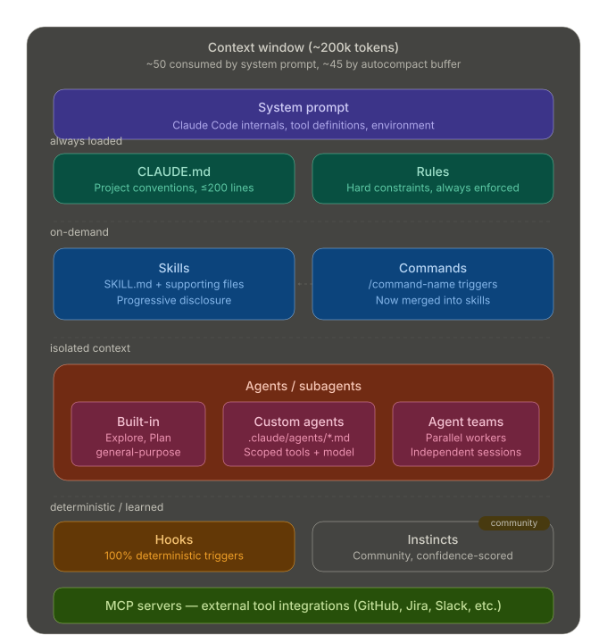
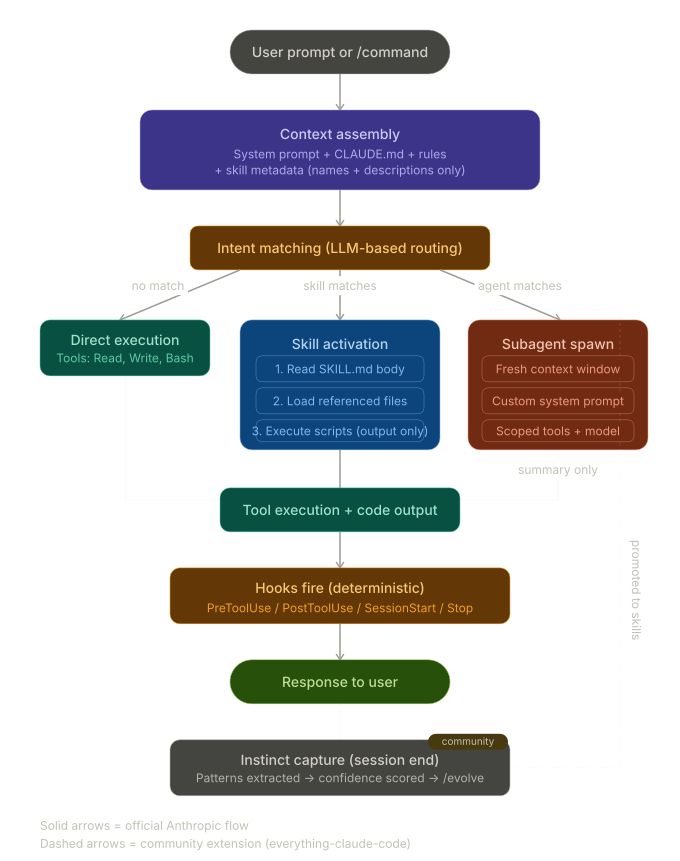

# Praxis

**Dev toolkit built through practice, not theory.**

A [Claude Code](https://docs.anthropic.com/en/docs/claude-code) plugin — agents and skills for the full journey from messy idea to shipped product.

Big frameworks try to own your process; when the process breaks, you can't see inside it. Praxis goes the other way: small, explicit, composable skills that chain into a few well-defined flows. Every skill is a readable Markdown file you can open, question, and adapt. Use a flow end to end, or grab one stage and ignore the rest.

## Install (30 seconds)

```bash
claude plugin marketplace add 0x4139/praxis
claude plugin install praxis@0x4139
```

Or for local development:

```bash
claude --plugin-dir /path/to/praxis
```

That's it — no per-repo setup step. Skills that touch GitHub discover your repo's labels, milestones, and issue types at run time instead of asking you to configure them up front.

<details>
<summary><strong>Updating</strong></summary>

Installed plugins auto-update in the background, but only when the `version` in `plugin.json` changes — every release bumps it. To update manually:

```bash
claude plugin marketplace update 0x4139   # refresh the marketplace catalog
claude plugin update praxis@0x4139        # update the installed plugin
```

Run `/reload-plugins` inside Claude Code to activate the update in the current session; new sessions pick it up automatically.

</details>

## Why These Skills Exist

Three failure modes show up in almost every agent-assisted project. Each has a fix in this repo.

### #1: The agent built the wrong thing

**The problem.** You dump a half-formed idea into the prompt, the agent fills every gap with its own assumptions, and you find out three files later that it didn't understand you at all. Worse: your "one idea" was actually four ideas glued together, and the agent picked an arbitrary blend of them.

**The fix** is [`/praxis:distill`](./skills/distill/SKILL.md) — a guided pipeline that refuses to let anything stay silently assumed:

| Stage | What it does for you |
|-------|----------------------|
| **elicit** | Interrogates the messy dump in frontier rounds — splits "one idea" into the five ideas it really is, asks every currently-answerable question at once, recommends an answer for each so you can accept a round in a few words. Facts get looked up by subagents; only *decisions* come to you. |
| **specify** | Turns the conversation into a spec file. Does **not** interview again — it synthesizes what you already said. |
| **slice** | Breaks the spec into vertical-slice tickets with native blocked-by edges, published in dependency order, grouped into milestones when phases emerge. Quizzes you on granularity before publishing anything. |
| **triage** | Sorts existing issues into `ready-for-agent` / `ready-for-human` / `needs-info` / `wontfix`, verifying claims and writing agent briefs as it goes. |
| **execute** | Works tickets off the frontier (blockers all closed) in an epic worktree — solo by default, parallel agents on request. |
| **track** | Standup, status, what's next, what's blocked — computed live from GitHub's dependency graph, no local state files. |

Intended flow: **idea dump → elicit → specify → slice → triage → execute**, with **track** answering "where are we?" at any point. Enter at any stage — arrive with a finished spec and it goes straight to slicing.

### #2: The work only exists in chat

**The problem.** Decisions made in conversation evaporate when the session ends. The next agent (or the next you) re-litigates everything, and "what are we building?" has a different answer every week.

**The fix** is durable artifacts with traceable identifiers, via [`/praxis:project-management`](./skills/project-management/SKILL.md): formal REQ-/AC- specs in `spec/`, machine-executable phased plans in `plan/`, and GitHub issues with real sub-issues, dependencies, and milestones — every stage self-contained enough that a cold reader with only the artifact and the repo can proceed.

Intended flow: **spec → implementation plan → epic + sub-issues**. `distill` publishes through this machinery; use `project-management` directly when you need contract-level rigor rather than speed.

### #3: The code drifts from your conventions

**The problem.** Agents write plausible code in *someone's* style — rarely yours. Every session reinvents error handling, naming, and test structure.

**The fix** is two-layered. Reference skills (`go-standards`, `typescript-standards`, `postgres-patterns`, …) hold the conventions, loaded automatically when relevant. Review agents (`go`, `security`, `database`, `tdd`, …) are dispatched proactively to check work against them. You don't invoke either — they activate when the task fits.

## The Flows

Skills compose into chains. These are the ones this repo is built around:

- **Idea → shipped:** [`distill`](./skills/distill/SKILL.md) (elicit → specify → slice → triage → execute, with track for status)
- **Spec → tracked execution:** [`project-management`](./skills/project-management/SKILL.md) (spec → plan → issues), then [`conventional-commits`](./skills/conventional-commits/SKILL.md) while you build
- **Huge or multi-session work:** [`ideation`](./skills/ideation/SKILL.md) to diverge, [`distill`](./skills/distill/SKILL.md) to converge, [`blueprint`](./skills/blueprint/SKILL.md) for per-step context briefs across sessions
- **Fundraising:** [`market-research`](./skills/market-research/SKILL.md) → [`product-positioning`](./skills/product-positioning/SKILL.md) → [`go-to-market`](./skills/go-to-market/SKILL.md) → [`investor-memo`](./skills/investor-memo/SKILL.md) → [`investor-materials`](./skills/investor-materials/SKILL.md) → [`investor-outreach`](./skills/investor-outreach/SKILL.md)
- **Content:** [`article-writing`](./skills/article-writing/SKILL.md) or [`academic-writing`](./skills/academic-writing/SKILL.md) → [`social-content`](./skills/social-content/SKILL.md) to repurpose
- **Media & Motion:** [`product-explainer-video`](./skills/product-explainer-video/SKILL.md) (position → script → storyboard → produce → variants) and [`slides`](./skills/slides/SKILL.md) for presentations

## Reference

Everything splits on one axis: **who invokes it**.

- **cmd** — user-invocable: you call it as `/praxis:skill-name`; the agent can also reach for it when the task fits. These orchestrate.
- **ref** — reference: loaded automatically by agents when relevant; you never call them. These hold the discipline.
- **Agents** — dispatched autonomously as subprocess reviewers; you never call them either.

### Workflow Skills (cmd)

| Skill | What it does for you |
|-------|----------------------|
| [`distill`](./skills/distill/SKILL.md) | Idea dump → elicit → specify → slice → triage → execute → track (see above) |
| [`project-management`](./skills/project-management/SKILL.md) | Formal specs, phased implementation plans, GitHub issues with sub-issues/dependencies/milestones |
| [`blueprint`](./skills/blueprint/SKILL.md) | Multi-session construction plans — each step carries a self-contained context brief a fresh agent can execute cold |
| [`ideation`](./skills/ideation/SKILL.md) | Parallel divergent ideation — isolated subagent branches under different cognitive frames, then score/cluster/commit |
| [`harness-design`](./skills/harness-design/SKILL.md) | Specs for recurring agent workflows — roles, context boundaries, validation gates, failure recovery |
| [`adhd`](./skills/adhd/SKILL.md) | ADHD-friendly output mode — action-first, bounded steps, visible state |
| [`article-writing`](./skills/article-writing/SKILL.md) | Blog posts, guides, tutorials, newsletters in a voice derived from your examples |
| [`academic-writing`](./skills/academic-writing/SKILL.md) | Research paper sections, paragraph flow, claim-evidence mapping, reviewer self-review |
| [`social-content`](./skills/social-content/SKILL.md) | Platform-native posts for X/LinkedIn/TikTok/YouTube, repurposed from long-form |
| [`market-research`](./skills/market-research/SKILL.md) | Competitive analysis, TAM/SAM/SOM, fund diligence with source attribution |
| [`go-to-market`](./skills/go-to-market/SKILL.md) | GTM strategy from problem statement to launch plan |
| [`product-positioning`](./skills/product-positioning/SKILL.md) | Differentiation diagnosis and one concrete positioning move (Purple Cow) |
| [`investor-memo`](./skills/investor-memo/SKILL.md) | Investment memos — founder-facing and VC-internal formats |
| [`investor-materials`](./skills/investor-materials/SKILL.md) | Pitch decks, one-pagers, financial models that stay internally consistent |
| [`investor-outreach`](./skills/investor-outreach/SKILL.md) | Cold emails, warm intro blurbs, follow-ups, update emails |
| [`product-explainer-video`](./skills/product-explainer-video/SKILL.md) | 30–90s explainer: position → script → storyboard → produce (HTML/Remotion) → social variants |

### Reference Skills (ref)

| Skill | Discipline it holds |
|-------|---------------------|
| [`go-standards`](./skills/go-standards/SKILL.md) | Naming, formatting, linting configuration |
| [`go-patterns`](./skills/go-patterns/SKILL.md) | Idiomatic Go patterns and conventions |
| [`go-backend`](./skills/go-backend/SKILL.md) | HTTP handlers, middleware, service layers, pgx |
| [`go-testing`](./skills/go-testing/SKILL.md) | Table-driven tests, benchmarks, fuzzing, TDD |
| [`typescript-standards`](./skills/typescript-standards/SKILL.md) | Naming, typing, ESLint, project structure |
| [`bun-backend`](./skills/bun-backend/SKILL.md) | API routes, Zod validation, caching, middleware |
| [`bun-runtime`](./skills/bun-runtime/SKILL.md) | Bun as runtime, package manager, bundler, test runner |
| [`frontend-patterns`](./skills/frontend-patterns/SKILL.md) | React, Next.js, state management, performance |
| [`api-design`](./skills/api-design/SKILL.md) | REST conventions, pagination, error responses, versioning |
| [`postgres-patterns`](./skills/postgres-patterns/SKILL.md) | Query optimization, indexing, schema design, RLS |
| [`database-migrations`](./skills/database-migrations/SKILL.md) | Schema changes, zero-downtime deploys, sqlc |
| [`docker-patterns`](./skills/docker-patterns/SKILL.md) | Compose, multi-stage builds, networking, security |
| [`design-system`](./skills/design-system/SKILL.md) | Design tokens, visual consistency, UI auditing |
| [`conventional-commits`](./skills/conventional-commits/SKILL.md) | Structured commit messages with SemVer correlation |
| [`slides`](./skills/slides/SKILL.md) | HTML presentations from scratch or PPT conversion |

### Agents

| Agent | Watches for |
|-------|-------------|
| [`api`](./agents/api.md) | API contract design, validation, client-server consistency |
| [`architecture`](./agents/architecture.md) | System design, scalability, technical trade-offs |
| [`database`](./agents/database.md) | PostgreSQL optimization, schema design, RLS, performance |
| [`debug`](./agents/debug.md) | Systematic root-cause analysis for bugs and test failures |
| [`documentation`](./agents/documentation.md) | Codemap generation, documentation freshness |
| [`frontend`](./agents/frontend.md) | Tailwind, component design, accessibility, responsiveness |
| [`go`](./agents/go.md) | Idiomatic Go — concurrency, error handling, performance |
| [`infra`](./agents/infra.md) | Kubernetes, Dockerfiles, CI/CD, deployment configuration |
| [`planning`](./agents/planning.md) | Implementation planning for complex features and refactors |
| [`security`](./agents/security.md) | Vulnerability detection, secrets scanning, OWASP Top 10 |
| [`tdd`](./agents/tdd.md) | Red-green-refactor enforcement |
| [`typescript`](./agents/typescript.md) | Type safety, async correctness, Node/web patterns |
| [`writing`](./agents/writing.md) | Architecture docs, memos, technical writing |

## Development

```bash
make help          # Show all targets
make validate      # Lint all skill and agent frontmatter
make list          # Show all agents and skills with descriptions
make install       # Symlink for local testing
make release       # Validate + bump version + tag + push
```

## Why "Praxis"

From Ancient Greek — **πρᾶξις** (*prâxis*). It means "action" or "practice," specifically the kind of doing where you learn by doing.

Aristotle distinguished three types of knowledge:

- **Theoria** — pure contemplation, knowing for the sake of knowing. Math, philosophy, cosmology.
- **Techne** — craft knowledge, knowing how to make things. Building, medicine, art.
- **Praxis** — knowledge that comes from engaged action. You act, reflect on the result, adjust, and act again. The knowledge *is* the practice.

The key distinction from techne: techne produces an external product (a house, a sculpture). Praxis transforms the practitioner themselves. The goal isn't an artifact — it's becoming better at the thing through doing it.

This isn't a static template collection. It's a toolkit that evolves because you use it, notice what's missing, and refine it. The skills get better because you practice with them.

<details>
<summary><strong>Architecture</strong> — how Claude Code loads plugins, agents, and skills</summary>

<br>

<p align="center">
  
</p>

<p align="center">
  
</p>

</details>

## Credits

The `distill` pipeline adapts ideas from [Matt Pocock's skills](https://github.com/mattpocock/skills) (MIT) — frontier-round grilling, synthesis-without-reinterview, tracer-bullet tickets, and triage states — and its execute/track stages adapt the delivery phases of [automazeio/ccpm](https://github.com/automazeio/ccpm) (MIT), rebuilt on GitHub's native dependency graph instead of local state files. The `product-explainer-video` pipeline adapts the five-beat scriptwriting framework from [gtmagents/gtm-agents](https://github.com/gtmagents/gtm-agents) (Apache-2.0) and vendors the production workflow and verify scripts from [iart-ai/explainer-video-skills](https://github.com/iart-ai/explainer-video-skills) (MIT), routing to the other [iart-ai motion packs](https://github.com/iart-ai/motion-skills) when installed. Parts of `project-management` adapt templates from [github/awesome-copilot](https://github.com/github/awesome-copilot) (MIT).

## Contributing

Open an issue or PR. If you're adding a skill, run `make validate` before pushing.

## License

MIT
